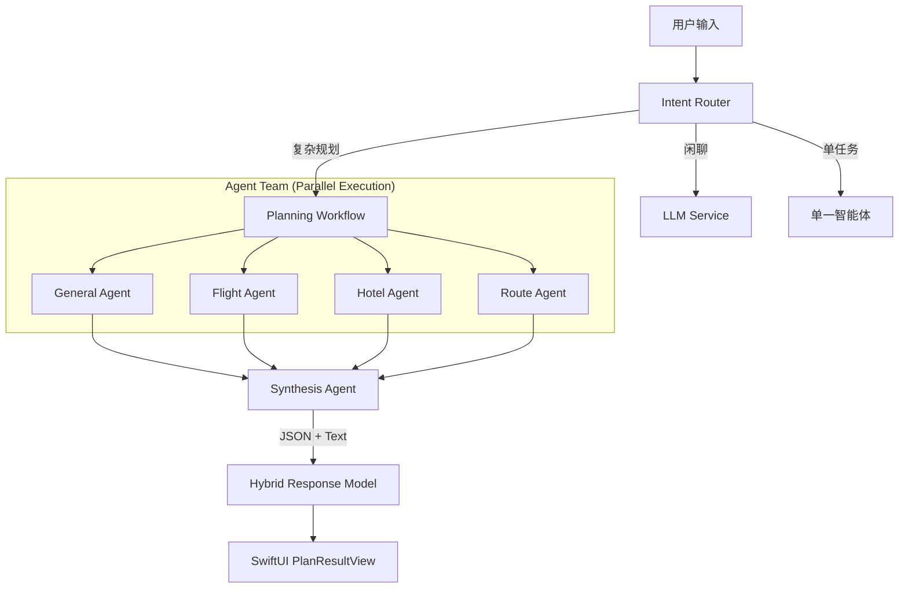

# ✈️ TripPal (TravelMasterPro) - 智能 AI 旅行规划助手

[](https://developer.apple.com/swift/)
[](https://developer.apple.com/ios/)
[]()

**TripPal (TravelMasterPro)** 是一个探索 AI 辅助旅行规划的实验性 iOS 项目。

面对传统旅行攻略需要在多个 App 间反复切换的繁琐流程，本项目尝试引入 **多智能体协作 (Multi-Agent System)** 架构。通过协调专门负责路线、酒店、机票和预算的智能体，将用户的自然语言需求转化为可视化的**结构化行程**。

它不仅仅是一个聊天机器人，而是尝试将“对话”转化为地图上的**具体路径**和**预算清单**，为您制定攻略提供一个高效的起点。

---

## ✨ 核心特性 (Key Features)

* **🧠 多智能体协同架构 (Multi-Agent Architecture)**
  * 系统包含 5 个专业智能体：航班专家、酒店专家、路线规划师、预算分析师、总控协调员。
  * 智能体之间**并行执行**，相比传统串行模式显著提升响应速度。
* **🚦 意图识别与智能路由 (Intent Router)**
  * 自动分析用户意图：
    * **闲聊模式**：快速响应（如“你好”）。
    * **单一查询**：定向调用工具（如“查明天去北京的票”）。
    * **复杂规划**：启动多智能体工作流（如“帮我规划上海3天2夜游，下周六出发预算3000”）。
* **📱 混合响应渲染 (Hybrid UI Rendering)**
  * “自然语言 + 结构化卡片”的双模输出。
  * 聊天气泡负责情感交流，动态卡片负责展示每日行程、预算仪表盘和风险提示。
* **🗺️ 智能路线优化**
  * 内置 **TSP (旅行商问题)** 算法，基于地理位置对乱序景点进行智能排序，确保不走回头路。
* **💰 深度预算控制**
  * 实时监控预算状态，提供精确到类别的花费拆解（交通/住宿/餐饮），并给出“预算充足”或“预算紧张”的评估。
* **🎨 个性化主题**
  * 集成可爱的 UI 主题风格，提供流畅的交互动画与触觉反馈。

### 🌗 双模态响应系统 (Dual-Mode Response)

TripPal 采用“感性对话 + 理性规划”的混合交互模式：

* **💬 自然语言交互 (Conversational)**:

  * 像真人向导一样与您对话。
  * 负责**意图确认**与**推荐理由阐述**（例如：“为您选择了这家酒店，因为它的性价比在市中心最高...”）。
* **📊 结构化可视方案 (Structured)**:

  * 将 AI 的思维转化为可落地的**交互式卡片**。
  * 包含**每日行程时间轴**、**动态地图路径**以及**深度预算仪表盘**，拒绝长篇大论的文字堆砌。

### ⚠️ 数据源与演示说明 (Data Disclaimer)

受限于商业旅行数据的开放性，本项目采用了 **Amadeus Testing API**。这意味着：

* **数据偏差**：航班时刻与价格可能不是实时的，部分为测试环境模拟数据。
* **演示用途**：所有数据仅用于展示多智能体系统的**逻辑处理与规划能力**。本应用旨在辅助用户制定**旅游攻略**，生成的方案仅供参考。

---

## 🛠 技术栈 (Tech Stack)

* **开发语言**: Swift 6
* **UI 框架**: SwiftUI, Combine
* **并发编程**: Swift Concurrency (Async/Await, TaskGroup)
* **大模型服务**: DeepSeek API (OpenAI Compatible)
* **地图服务**: MapKit, CoreLocation (集成高德/苹果地图逻辑)
* **设计模式**: MVVM, Flow Controller, Agent Orchestration (智能体编排)

---

## 🏗 系统架构 (System Architecture)

TripPal 采用分层架构设计，以此保证系统的可扩展性与稳定性：



### 核心模块说明

1. **PlanningFlow**: 使用 `withThrowingTaskGroup` 实现任务的并行分发与状态管理。
2. **ToolCallAgent**: 实现了基于 ReAct (Reasoning + Acting) 模式的 Base Agent，支持工具调用。
3. **SynthesisAgent**: 负责将各路智能体的碎片化信息整合成符合 JSON Schema 的结构化数据。

---

## 📂 项目结构

```text
TravelMasterPro/
├── Agent/               # 智能体核心逻辑 (Flight, Hotel, BaseProtocols...)
├── Flow/                # 业务流程控制 (PlanningFlow, IntentRouter)
├── Tool/                # AI 可调用工具集 (RoutePlanner, BudgetAnalyzer...)
├── Service/             # 基础设施服务 (LLmService, MemoryService)
├── Models/              # 数据模型与 Codable 定义
├── Managers/            # 业务管理器 (Location, RouteCalculation)
└── UI/                  # SwiftUI 视图层
    ├── PlanResultView.swift    # 结构化卡片渲染
    └── LegacyContentView.swift # 主聊天界面
```

---

## 🚀 快速开始 (Getting Started)

### 环境要求

* macOS 14.0+
* Xcode 15.0+
* iOS 17.0+

### 安装步骤

1. **克隆仓库**

   ```bash
   git clone https://github.com/YourUsername/TripPal.git
   cd TripPal
   ```
2. **配置 API Key**

   需要在 `Configuration/` 目录下配置以下三个服务的 API Key：

   * **AI 服务** (`AIConfig.plist`): 填入 DeepSeek 或 OpenAI API Key。
   * **地图服务** (`MapConfig.plist`): 填入高德地图 (AMap) Web 服务 Key。
   * **票务服务** (`TicketConfig.plist`): 填入 Amadeus 开发平台的 API Key 和 Secret。

   *(注：出于安全考虑，这些文件默认不上传 Key，请本地配置)*
3. **运行项目**

   * 使用 Xcode 打开 `TravelMasterPro.xcodeproj`。
   * 选择模拟器 (如 iPhone 16 Pro) 并点击 Run (⌘R)。

---

## 📸 功能展示 (Screenshots)

### 1. 智能聊天与意图识别

支持自然语言交互、多轮对话与用户意图的精准识别。

|                          |                                        |
| :-----------------------: | -------------------------------------- |
|  |  |

### 2. 结构化行程方案

包含时间轴、预算分析和备选方案的交互式卡片。

|                                              |                                              |
| :------------------------------------------: | :------------------------------------------: |
|  |  |
|      |                  |

### 3. 地图规划与高级功能

支持在地图上自由规划路线、识别地点以及解析外部攻略链接。

|                                                |                                          |
| :---------------------------------------------: | :--------------------------------------: |
|    |  |
|  |      |
|              |                                          |

---

## 🤝 贡献 (Contributing)

欢迎提交 Pull Request 或 Issue！

1. Fork 本仓库
2. 创建您的特性分支 (`git checkout -b feature/AmazingFeature`)
3. 提交更改 (`git commit -m 'Add some AmazingFeature'`)
4. 推送到分支 (`git push origin feature/AmazingFeature`)
5. 开启 Pull Request

---

## 📄 许可证 (License)

本项目采用 MIT 许可证 - 详见 [LICENSE](LICENSE) 文件。

---

> **作者**: TvT669
>
> *这是一个探索 AI与传统 App 深度结合的实验性项目，旨在展示 LLM 在复杂任务规划中的潜力。*
